# Informe de Verificación y Entrega — Fase 4

## Grupo 08

- **Integrantes:** Melissa Braunstein · Santiago Gonzalez D'Angelo · Maria Pia Porzio · Leandro Andres Noval · Pilar Wagner
- **Repositorio:** https://github.com/santigonzalezdangelo/alentapp
- **Fecha:** 07/06/2026

---

## 4.1. Verificación Técnica

### Tamaño de imágenes

| Métrica | Antes (desarrollo) | Después (producción) | Mejora |
|---------|-------------------|---------------------|--------|
| Tamaño imagen API | 408 MB | 134 MB | −67.2% |
| Tamaño imagen Web | 223 MB | 23.3 MB | −89.6% |
| Tiempo de startup API | 33.843 s | 0.310 s | −99.1% |
| Memoria API (idle) | 124.4 MiB | 192.6 MiB | +54.8% |

La imagen de la API se redujo aproximadamente un 67.2% gracias al uso de multi-stage build, la separación de dependencias de compilación y ejecución, y la eliminación de herramientas innecesarias para producción. La imagen del frontend se redujo un 89.6%, pasando de una imagen basada en Node.js utilizada para desarrollo a una imagen mínima basada en Nginx para servir contenido estático. El tiempo de startup de la API se redujo un 99.1% respecto del entorno de desarrollo. Por otro lado, el consumo de memoria observado en producción fue superior al registrado en desarrollo (+54.8%), comportamiento atribuible a la incorporación de componentes de observabilidad (OpenTelemetry, Prometheus y Grafana) y a la ejecución de servicios adicionales asociados al entorno productivo.

### Endpoints accesibles

| Endpoint | Resultado |
|----------|-----------|
| `curl http://localhost:3000/api/v1/socios` | ✅ 200 OK |
| `curl http://localhost:3000/api/v1/sports` | ✅ 200 OK |
| `curl http://localhost:3000/api/v1/lockers` | ✅ 200 OK |
| `curl http://localhost:3000/api/v1/payments` | ✅ 200 OK |
| `curl http://localhost:3000/api/v1/disciplines` | ✅ 200 OK |
| `curl http://localhost:3000/api/v1/medical-certificates` | ✅ 200 OK |
| `curl http://localhost:3000/health` | ✅ 200 OK |
| `curl http://localhost/` (frontend vía nginx) | ✅ 200 OK |

### Estado de los contenedores

```
NAME                  IMAGE                   STATUS
alentapp-api          alentapp-api:prod        Up (healthy)
alentapp-db           postgres:16-alpine       Up (healthy)
alentapp-grafana      grafana/grafana:latest   Up
alentapp-prometheus   prom/prometheus:latest   Up
alentapp-web          alentapp-web:prod        Up (healthy)
```

### Evidencias

**Figura 1.** Comparación de tamaño de imagen API.

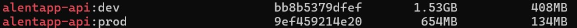

**Figura 2.** Comparación de tamaño de imagen Web.

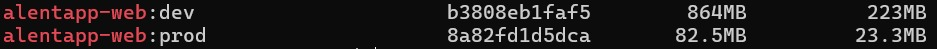

**Figura 3.** Startup API (desarrollo)

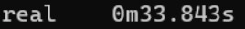

**Figura 4.** Startup API (producción)

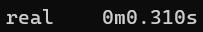

**Figura 5.** Memoria API (desarrollo)

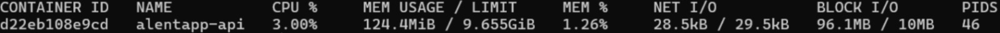

**Figura 6.** Memoria API (producción)

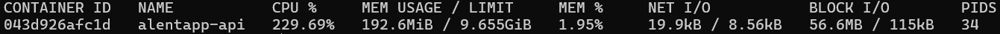

---

## 4.2. Verificación de Seguridad

| Medida | Verificación | Resultado |
|--------|-------------|-----------|
| Usuario no-root | La API corre con el usuario `node` definido en el Dockerfile.prod | ✅ |
| Sin herramientas de build | `tsc` y `npm` no están disponibles en la imagen final | ✅ |
| Read-only filesystem | `docker exec alentapp-web touch /test` falla con `Read-only file system`. La API tiene `read_only: false` por compatibilidad con Prisma. | ✅ |
| Capabilities mínimas | `cap_drop: ALL` aplicado en el compose productivo. Se verificó que `docker exec alentapp-api date -s "2020-01-01"` falla con `Operation not permitted`. | ✅ |
| Variables sensibles via `.env` | `DATABASE_URL`, `POSTGRES_PASSWORD` y demás variables no están hardcodeadas en el compose | ✅ |
| Healthchecks funcionando | `docker compose ps` muestra estado `healthy` en api, web y db | ✅ |
| Límites de recursos | CPU y memoria definidos por servicio en el compose productivo | ✅ |
| Logging con rotación | Driver `json-file` con `max-size: 10m` y `max-file: 3` | ✅ |

---

## 4.3. Verificación de Observabilidad

| Ítem | Verificación | Resultado |
|------|-------------|-----------|
| OpenTelemetry expone métricas | `docker exec alentapp-api wget -qO- http://localhost:9464/metrics` devuelve métricas en formato Prometheus | ✅ |
| Prometheus scrapea el endpoint | Target `alentapp-otel` en estado **UP** en `http://localhost:9090/targets` | ✅ |
| Métricas RED presentes | `http_requests_total`, `http_request_duration`, `http_requests_errors_total`, `http_requests_active` visibles en el endpoint | ✅ |
| Rutas normalizadas | Las métricas registran `/api/v1/socios/:id` en lugar de `/api/v1/socios/99999` | ✅ |
| Grafana datasource configurado | Prometheus configurado como datasource apuntando a `http://prometheus:9090` | ✅ |
| Dashboard RED funcional | 6 paneles visibles con datos reales | ✅ |
| Paneles responden al tráfico | Los gráficos actualizan en tiempo real al generar requests | ✅ |
| Métricas de error reflejan 4xx | El panel "Tasa de error %" y "Errores por endpoint" muestran las requests a rutas inexistentes | ✅ |

### Métricas verificadas en el endpoint

```
# HELP http_requests_total Total de requests HTTP
# TYPE http_requests_total counter
http_requests_total{method="GET",route="/health",status="200"} 36

# HELP http_request_duration Duración de requests en ms
# TYPE http_request_duration histogram
http_request_duration_count{method="GET",route="/health"} 36

# HELP http_requests_active Requests concurrentes en ejecución
# TYPE http_requests_active gauge
http_requests_active{method="GET",route="/health"} 0
```

---

## 4.4. Documentación de Decisiones

### Arquitectura final del sistema

```text
[Browser]
    │
    ▼
[nginx — puerto 80]          ← alentapp-web:prod (React compilado)
    │
    ▼ (requests a /api)
[Fastify API — puerto 3000]  ← alentapp-api:prod
    │                    │
    ▼                    ▼
[PostgreSQL:5432]   [OTel Exporter — puerto 9464]
                         │
                         ▼
                    [Prometheus — puerto 9090]
                         │
                         ▼
                    [Grafana — puerto 3001]
```

Todos los servicios se comunican dentro de la red Docker `alentapp-network` usando nombres de servicio. El puerto 9464 de métricas no está expuesto al host, solo accesible desde la red interna.

### Decisiones técnicas

**Multi-stage build para la API**
Se eligió un build en tres etapas (deps → build → runtime) para separar claramente la instalación de dependencias, la compilación de TypeScript y la ejecución. Esto permite que la imagen final contenga únicamente el código compilado y las dependencias de producción, sin incluir TypeScript, tsx ni ninguna herramienta de desarrollo.

**nginx para el frontend**
En lugar de servir el frontend con Node.js en producción, se optó por nginx:stable-alpine como runtime final. Esto redujo la imagen de 223 MB a 23.3 MB (reducción del 90%) y mejora significativamente la performance de entrega de assets estáticos.

**Capa centralizada de métricas RED en app.ts**
En lugar de instrumentar cada controller manualmente, las métricas RED se implementaron mediante los hooks `onRequest` y `onResponse` de Fastify directamente en `app.ts`. Esto garantiza que todos los endpoints queden cubiertos de forma uniforme sin duplicar lógica, y permite que los controllers mantengan su única responsabilidad.

**Puerto 9464 solo en red interna**
El endpoint de métricas de OpenTelemetry no se expone al host. Prometheus accede a él desde dentro de la red Docker usando el nombre de servicio `api:9464`. Esto reduce la superficie de ataque y sigue el principio de mínimo privilegio.

**PrometheusExporter en lugar de OTLP**
Se eligió exportar directamente a Prometheus en lugar de usar un collector OTLP intermedio. Para el alcance del proyecto esto simplifica la arquitectura sin perder funcionalidad, ya que Prometheus puede scrapear directamente el endpoint expuesto por el SDK de OpenTelemetry.

### Problemas encontrados y soluciones

**El import de telemetry.ts no era el primero en app.ts**
Si OTel no se inicializa antes que el resto de los módulos, los auto-instrumentations de Fastify y HTTP no parchean correctamente los módulos y las métricas automáticas no se generan. El síntoma es que el endpoint /metrics existe pero está vacío o solo muestra target_info. Se resolvió moviendo el import de telemetry.ts a la primera línea del archivo.

**División por cero en la métrica de tasa de error**
Al arrancar la aplicación, antes de recibir cualquier request, la query de tasa de error calculaba: `sum(rate(http_requests_errors_total[1m])) / sum(rate(http_requests_total[1m])) * 100` Como el denominador era 0, Prometheus devolvía NaN y el panel de "Tasa de error %" aparecía vacío o con un valor inválido. Solución: usar `clamp_min` para forzar un mínimo de 1 en el denominador. 

**Puerto 9464 no accesible desde el host**
Al intentar verificar las métricas con `curl http://localhost:9464/metrics` desde la terminal, la conexión fue rechazada. Esto era esperado porque el puerto está intencionalmente no mapeado al host. Se resolvió ejecutando el curl desde dentro del contenedor con `docker exec alentapp-api wget -qO- http://localhost:9464/metrics`.

### Capturas del dashboard RED

> - Vista general del dashboard con tráfico continuo de healthchecks:
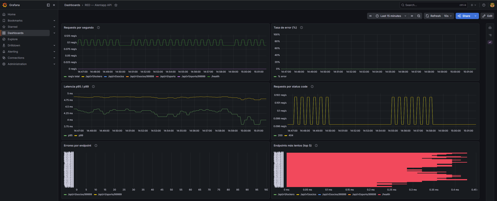

> - Dashboard durante el pico de tráfico generado con el script de prueba:
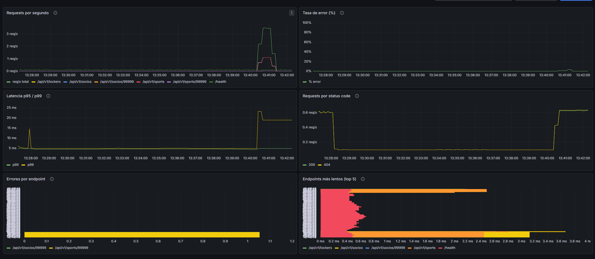

> - Panel Requests por segundo — se observa el pico al correr el script de prueba:
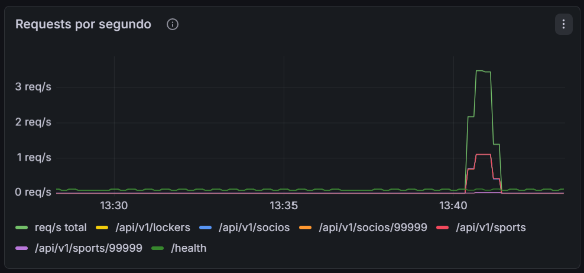

> - Panel Tasa de error — muestra el spike de errores 4xx generados:
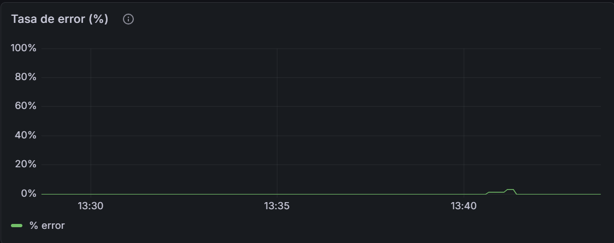

> - Panel Latencia p95/p99 — la latencia p99 sube a ~20ms durante el pico de tráfico:
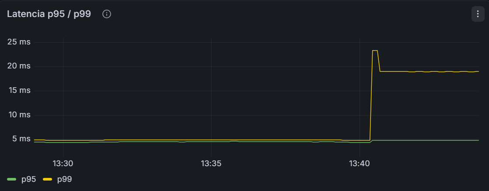

> - Panel Requests por status code — distribución entre respuestas 200 y 404:
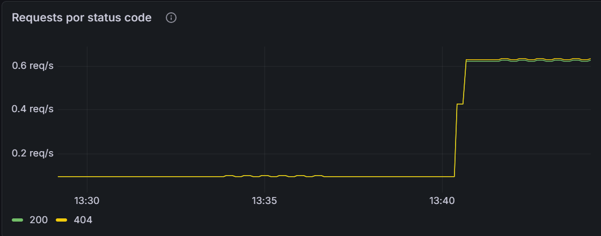

> - Panel Errores por endpoint — identifica `/api/v1/socios/99999` y `/api/v1/sports/99999` como endpoints con errores:
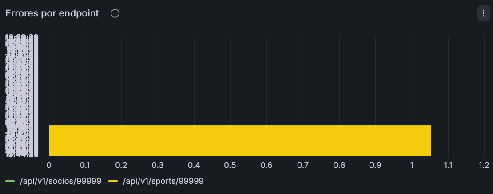

> - Panel Endpoints más lentos — top 5 rutas ordenadas por latencia promedio:
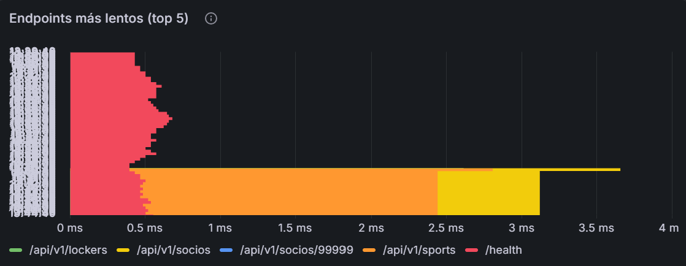


